*This project has been created as part of the 42 curriculum by vgoh*

# RAG against the machine

**Table of contents**
- [RAG against the machine](#rag-against-the-machine)
  - [Description](#description)
  - [Instructions](#instructions)
    - [Requirements](#requirements)
    - [Quick commands](#quick-commands)
  - [Manual usage](#manual-usage)
    - [1) Install dependencies](#1-install-dependencies)
    - [2) Ingest and index](#2-ingest-and-index)
    - [3) Search](#3-search)
    - [4) Evaluate](#4-evaluate)
    - [5) Generate answers](#5-generate-answers)
  - [Example usage](#example-usage)
  - [System architecture](#system-architecture)
  - [Chunking strategy](#chunking-strategy)
  - [Retrieval method](#retrieval-method)
  - [Performance analysis](#performance-analysis)
  - [Design decisions](#design-decisions)
  - [Challenges faced](#challenges-faced)
  - [Glossary](#glossary)
    - [Retrieval Augmented Generation (RAG)](#retrieval-augmented-generation-rag)
    - [Corpus](#corpus)
    - [TF-IDF](#tf-idf)
    - [BM25](#bm25)
    - [Semantic embedding](#semantic-embedding)
    - [Transformer](#transformer)
    - [MiniLM](#minilm)
    - [ChromaDB](#chromadb)
    - [Recall@k](#recallk)
    - [tqdm](#tqdm)
    - [Fire](#fire)
  - [Resources](#resources)
    - [Disclosure of AI Usage](#disclosure-of-ai-usage)


## Description

**RAG against the machine** is a Retrieval-Augmented Generation (RAG) project pipeline that ingests and indexes a provided codebase, retrieves the most relevant snippets for a question, hands them to a small local model (Qwen3-0.6B) to generate a grounded answer, and measures retrieval quality with recall@k.

[↑ Back to Table of Contents](#rag-against-the-machine)

## Instructions
### Requirements
* python3.10+
* uv 
  
### Quick commands
A Makefile has been created for convenience. After cloning the repository, you may run the following commands:
```bash
make install       # Installs the dependencies required
make run           # Runs the pipeline for a single default query 
make run-docs      # Runs the pipeline for the default docs dataset
make run-code      # Runs the pipeline for the default code dataset
make answer-docs   # Generates the answer for the docs dataset
make answer-code   # Generates the answer for the code dataset
make debug         # Debugs the program with python debugger
make lint          # Runs mypy and flake8 linting tests
make lint-strict   # Runs mypy with the --strict flag and flake8
make clean         # Removes all build files
```
To alter the defaults, please proceed to the Makefile and edit the necessary file paths, k values or queries. The answer commands have been kept separate from the pipeline due to performance incompatibility issues with lower-end devices, so the run commands are mainly to evaluate recall@k rankings.

[↑ Back to Table of Contents](#rag-against-the-machine)

## Manual usage
If you would like to run the program manually, you may follow the steps below:

### 1) Install dependencies
   ```bash
   uv sync
   ```

### 2) Ingest and index

    uv run python -m src index -max_chunk_size <int>
    

### 3) Search
For a single query:
  
    uv run python -m src answer <query> -k <int>
  
Or across an entire dataset: 
        
    uv run python -m src search dataset -dataset_path <path> -save_directory <directory>
  
### 4) Evaluate
   
    uv run python -m src evaluate –student_search_results_path <path> –dataset_path <path>
   
### 5) Generate answers
For the single query:
        
    uv run python -m src search <query> -k <int>
        
Or across the entire dataset: 
        
    uv run python -m src answer_dataset –student_search_results_path <path> –save_directory <directory>
        

[↑ Back to Table of Contents](#rag-against-the-machine)

## Example usage

1. First we need build the index with an example max chunk size of 2000:
   ```bash
   uv run python -m src index --max_chunk_size 2000
   ```

2. Then we search the dataset:
    ```bash
    uv run python -m src search_dataset \
     --dataset_path data/datasets/UnansweredQuestions/dataset_docs_public.json \
     --k 10 \
     --save_directory data/output/search_results/UnansweredQuestions \
     --use_cache False
    ```
    This gives us a JSON file in `data/output/search_results/UnansweredQuestions` (truncated for readability):
    ```json
    {
      "search_results": [
        {
          "question_id": "q1",
          "question": "How to configure OpenAI compatible server?",
          "retrieved_sources": [
            {
              "file_path": "data/raw/vllm-0.10.1/docs/serving/openai_compatible_server.md",
              "first_character_index": 9867,
              "last_character_index": 10100
            },
            {
              "file_path": "data/raw/vllm-0.10.1/vllm/entrypoints/openai/api_server.py",
              "first_character_index": 267,
              "last_character_index": 400
            },
            {
              "file_path": "data/raw/vllm-0.10.1/docs/serving/deploying_with_docker.md",
              "first_character_index": 534,
              "last_character_index": 723
            }
          ]
        },
        {
          "question_id": "q2",
          "question": "How does vLLM handle continuous batching?",
          "retrieved_sources": [
            {
              "file_path": "data/raw/vllm-0.10.1/vllm/core/scheduler.py",
              "first_character_index": 1245,
              "last_character_index": 1567
            },
            {
              "file_path": "data/raw/vllm-0.10.1/docs/design/continuous_batching.md",
              "first_character_index": 0,
              "last_character_index": 234
            }
          ]
        }
      ],
      "k": 10
    }
    ```

3. Once we have the search results, we can evaluate our recall@k ranking:
   ```bash
   uv run python -m src evaluate \
   --student_search_results_path data/output/search_results/UnansweredQuestions/dataset_docs_public.json \
   --dataset_path data/datasets/AnsweredQuestions/dataset_docs_public.json \
   --k 10
   ```
   With a k of 10, the recall@k ranking for this search result should be `Recall@10: 0.9100`.

4. We can generate the answers using:
    ```bash
    uv run python -m src answer_dataset \
     --student_search_results_path data/output/search_results/UnansweredQuestions/dataset_docs_public.json \
     --save_directory data/output/search_results_and_answer/UnansweredQuestions \
     --max_questions 10
    ```
    This creates a JSON file with the search results and the answer for 10 questions in `data/output/search_results_and_answer/UnansweredQuestions` (truncated for readability):
    ```json
    {
      "search_results": [
        {
          "question_id": "q1",
          "question": "How to configure OpenAI compatible server?",
          "retrieved_sources": [
            {
              "file_path": "data/raw/vllm-0.10.1/docs/serving/openai_compatible_server.md",
              "first_character_index": 9867,
              "last_character_index": 10100
            }
          ],
          "answer": "To configure the OpenAI compatible server in vLLM, you need to start the server with the --api-server flag and specify the model path. You can also configure parameters like --port, --host, and --max-num-batched-tokens."
        }
      ],
      "k": 10
    }
    ```
    *Do be warned that this will take a long time to generate depending on your device specs.*

[↑ Back to Table of Contents](#rag-against-the-machine)

## System architecture

```mermaid
---
config:
  theme: base
  themeVariables:
    primaryColor: '#b9eee8'
    primaryTextColor: '#123b38'
    primaryBorderColor: '#2aaea2'
    lineColor: '#7777ff'
---
flowchart LR
    %% INDEXING STAGE
    subgraph IDX["INDEXING"]
        direction LR
        raw["data/raw"] --> ingest["Ingester"] --> fileType{"File Type?"}
        
        %% Chunker Stack (Saves horizontal space)
        fileType -- ".py" --> python["Python Chunker"]
        fileType -- ".md" --> markdown["Markdown Chunker"]
        fileType -- "Other" --> generic["Generic Chunker"]
        
        python & markdown & generic --> index["BM25 Index"] --> processed["data/processed"]
    end

    %% RETRIEVAL STAGE
    subgraph RET["RETRIEVAL"]
        direction LR
        query["Query"] --> retriever["BM25 Retriever"] --> topK["Top-k Sources"] --> minimal["MinimalSource"]
    end

    %% AUGMENTATION STAGE
    subgraph AUG["AUGMENTATION"]
        direction LR
        original["Read Original Files"] --> ranges["Slice Character Ranges"] --> context["Build Context Prompt"]
    end

    %% GENERATION STAGE
    subgraph GEN["GENERATION"]
        direction LR
        model["Qwen3-0.6B"] --> answer["Generated Answer"]
    end

    %% COMPACT CROSS-STAGE LINKING
    processed --> retriever
    minimal --> original
    context --> model

    %% STYLE DEFINITIONS
    classDef stage fill:#b9eee8,stroke:#2aaea2,color:#123b38,stroke-width:1px;
    classDef output fill:#008f7a,stroke:#00695c,color:#ffffff,stroke-width:1px;
    
    class raw,ingest,fileType,python,markdown,generic,index,processed stage;
    class query,retriever,topK,minimal stage;
    class original,ranges,context stage;
    class model stage;
    class answer output;

    %% Transparent background fix ('fill:none')
    style IDX fill:none,stroke:#7777ff,stroke-width:1px
    style RET fill:none,stroke:#7777ff,stroke-width:1px
    style AUG fill:none,stroke:#7777ff,stroke-width:1px
    style GEN fill:none,stroke:#7777ff,stroke-width:1px
```



[↑ Back to Table of Contents](#rag-against-the-machine)

## Chunking strategy

Instead of directly importing LangChain's libraries I opted to imitate their `RecursiveCharacterTextSplitter` and how they classified their Python and Markdown separators. `RecursiveCharacterTextSplitter` takes `chunk_size: int`, `chunk_overlap: int` and `separators: List[str]`. Based on the highest-priority separator in the list, it splits the text into chunks <= 2000 characters and if a chunk is too large, it will be split based on the next separator in the priority list, with the final fallback being to split by character.

Default separators used: `"\n\n", "\n", " ", ""`

Python separators used: `"\nclass ", "\ndef ", "\n\tdef ", "\n\n", "\n", " ", ""` (Prioritizes `class` and `def` to keep logic intact.)

Markdown separators used: `"\n#{1,6} ", "\n\n", "\n", " ", ""` (Prioritizes headings and paragraphs to preserve document structure.)

Besides that, the required max chunk size specified for this project is 2000 characters, and chunk overlap was set to 200 characters to preserve context between chunks.

[↑ Back to Table of Contents](#rag-against-the-machine)

## Retrieval method

[↑ Back to Table of Contents](#rag-against-the-machine)

## Performance analysis

[↑ Back to Table of Contents](#rag-against-the-machine)

## Design decisions

[↑ Back to Table of Contents](#rag-against-the-machine)

## Challenges faced

* Overcoming the sheer scope of the topic. Machine learning and RAG have many concepts to master and more libraries in Python to learn so the challenge was to cram everything into my brain in as little time possible. I tend to zone out if I take in too much information in one sitting so it was a hurdle to digest everything.
* Finding the right resources to tackle this topic. This field is full of technical jargon that it's hard for someone not in the know to understand concepts easily.

[↑ Back to Table of Contents](#rag-against-the-machine)

## Glossary

### Retrieval Augmented Generation (RAG)
An AI architecture that works by:
* Ingesting documents and chunking them into smaller segments.
* Indexing them into vector embeddings and storing them in a vector database.
* Retrieving a query and vectorizing it, then searching the database for similar chunks.
* Augmenting the query with the retrieved data and prompting the model to generate a more accurate answer.
  
Benefits:
* Reduces hallucinations by providing more grounded and relevant data.
* Allows private data to be used without retraining.
* Only relevant chunks are added to the query, reducing token usage.

### Corpus
An external database of documents fed into a [RAG](#retrieval-augmented-generation-rag) pipeline.

### TF-IDF
Term Frequency-Inverse Document Frequency (TF-IDF) scores how important a word is to a specific document within a corpus.

* Term Frequency (TF) - How often a word appears in a specific document. If it appears a lot, it must be important. (e.g: In a cooking article, "recipe" will have a high TF score.)
* Inverse Document Frequency (IDF) - How rare the word is across all documents in the corpus. If it appears in almost every document it isn't unique or helpful and will be penalised. (e.g: "is" and "the" would have a low IDF score.)
  
The final score is TF x IDF.  High scores are assigned to unique words that appear frequently in a specific document, while low scores are assigned to common words found everywhere in the corpus.

Formula:

$\text{TF-IDF}(t, d, D) = \text{TF}(t, d) \times \log\left(\frac{|D|}{1 + |\{d \in D : t \in d\}|}\right)$

> *Disclaimer: This formula is just for reference, I'm not a math major 😭 Fortunately for people like me, Python already has libraries that handle the math in the background.*

### BM25 
Best Match (25th iteration) builds directly on [TF-IDF](#tf-idf) by fixing its two issues:
* Issue 1 (Document length) 
  - There is no consideration for document length, longer documents naturally score higher due to more words and more chances to hit keywords.
  - BM25 solves this issue by introducing an additional parameter called b (usually 0.75) which measures document length against the average length of all documents in the corpus.
* Issue 2 (Linear frequency)
  - Term frequency is linear and there are no diminishing returns. If a word appears 10 times it would have a TF score 10 times higher than if it appeared once.
  - BM25 solves this issue by adding a capping parameter called k1 (usually 1.2 or 2.0) that controls term frequency saturation so instead of scaling linearly, the score curves and flattens out.

Formula:

$\text{Score}(D, Q) = \sum_{i=1}^{n} \text{IDF}(q_i) \times \frac{f(q_i, D) \cdot (k_1 + 1)}{f(q_i, D) + k_1 \cdot \left(1 - b + b \cdot \frac{|D|}{\text{avgdl}}\right)}$

The bm25s library is used to tokenize, index, retrieve and save/load the data from the disk in this project.

> *Disclaimer: This formula is just for reference, I'm not a math major 😭 Fortunately for people like me, Python already has libraries that handle the math in the background.*

### Semantic embedding
Keyword retrieval strategies like [BM25](#bm25) or [TF-IDF](#tf-idf) ignore semantic context. Semantic embedding solves this problem by categorizing words into multi-dimensional vectors. 

Context can be calculated based on the proximity of one word's vector coordinates to another. (e.g: "dog" and "canine" would be considered unrelated in BM25, but due to their closeness in vector space, semantic embedding would identify their relationship.)

For this project, a vector index is built using [MiniLM](#minilm) and stored in [ChromaDB](#chromadb).

### Transformer
A transformer is an AI architecture that processes text in parallel. It reads an entire sentence all at once, instead of word by word. It uses an attention mechanism that acts as a highlighter for context clues within a sentence.

For example, the word "it" changes meaning based on the context clues the transformer highlights:
* Example A: "The chicken didn't cross the road because it was too tired." (it ➔ chicken is highlighted)
* Example B: "The chicken didn't cross the road because it was too wide." (it ➔ road is highlighted)
  
### MiniLM
MiniLM is a modern, CPU-efficient semantic embedding model that converts text using [transformers](#transformer) into 384-dimensional contextual vectors.

### ChromaDB
ChromaDB is an open-source vector database used to store, manage and query vector embeddings. It uses a pre-trained [MiniLM](#minilm) model to convert text into vectors and repeats the same process with queries to calculate the distances to the stored vectors in order to find and retrieve closest matches.

### Recall@k
The percentage of relevant items in the corpus within the top k search results.

$\text{Recall@k} = \frac{\text{No. of relevant items found in top k}}{\text{Total no. of relevant items in corpus}}$

For example, a database has 10 python files alongside other file types. We are searching for .py files and looking at the top 5 results (k = 5):

$\text{Recall@5} = \frac{\text{4}}{\text{10}}$

* If 4 out of the 5 results are .py files, Recall@5 = 40% (4/10)
* The remaining 6 .py files are outside the scope of k.

The goal is to achieve the highest Recall@k score with the smallest k possible in order to save system memory.

### tqdm
tqdm is a function from the tqdm library that wraps an iterable to display a progress bar in the terminal.

Example from `ingester.py`:
```python
 for file_path in tqdm(files, desc="Ingesting files"):
```
CLI Output:
```
      Percentage to completion                 No. of tasks completed        Iterations/sec
                  │                                       │                         │ 
Ingesting files: 100%|███████████████████████████████| 3226/3226 [00:01<00:00, 1998.00it/s]
                                     │                                 │            
                               Progress bar                Elapsed time/Est time left
```

### Fire
Python Fire is an open-source CLI tool created by Google that exposes classes, functions or variables as executable CLI commands without the need for manually writing parsing code.

For example, the function `index` is exposed using a dictionary passed into `fire.Fire()` in `__main__.py`:

```python
if __name__ == "__main__":
    fire.Fire({
        "index": index,
        "search": search,
        "search_dataset": search_dataset,
        "answer": answer,
        "answer_dataset": answer_dataset,
        "evaluate": evaluate,
        "api": run_api
    })
```
This allows you to call `index` directly from the CLI using `uv run python -m src index`. Do note that this can only run because `__main__.py` is executed in the module `src`.

[↑ Back to Table of Contents](#rag-against-the-machine)

## Resources

* [Dictionary of AI Coding by Matt Pocock (used to understand AI terminologies)](https://www.aicodingdictionary.com/)
* [TFIDF: Data Science Concepts by ritvikmath](https://youtu.be/OymqCnh-APA?si=vrCQdNuxBp7rAyPQ)
* [BM25 : The Most Important Text Metric in Data Science by ritvikmath](https://youtu.be/ruBm9WywevM)
* [The 5 Levels Of Text Splitting For Retrieval by Greg Kamradt](https://youtu.be/8OJC21T2SL4?si=x5KsyhCeyv9V-rEh)
* [LangChain's GitHub](https://github.com/langchain-ai/langchain/blob/master/libs/text-splitters/langchain_text_splitters/character.py)
* [Learn Text Embeddings in 20 Minutes (full guide for beginners) by Thu Vu](https://youtu.be/Q6TBHDgWCDQ)
* [What are Transformers (Machine Learning Model)? by IBM Technology](https://youtu.be/ZXiruGOCn9s)
* [Getting Started with ChromaDB - Lowest Learning Curve Vector Database For Semantic Search by Johnny Code](https://youtu.be/QSW2L8dkaZk)
* [Never Forget Again! // Precision vs Recall with a Clear Example of Precision and Recall by Kimberly Fessel](https://youtu.be/qWfzIYCvBqo)
* [Python Progress Bars with tqdm - Visually Explained by Visually Explained](https://youtu.be/VAoGebgGTdM?si=sk6jt61YAuuFHBsg)
* [Markdown All in One by Yu Zhang (used for the table of contents)](https://marketplace.visualstudio.com/items?itemName=yzhang.markdown-all-in-one)
  
[↑ Back to Table of Contents](#rag-against-the-machine)

### Disclosure of AI Usage

DeepSeek was used to answer some more in-depth questions I had about chunking and retrieval, as well as error handling and finding edge cases in my pipeline, while Gemini was used for asking basic questions about topics such as tqdm and Fire CLI to make sure my glossary was acceptable, and how to include a table of contents, flowchart and LaTeX math in my readme.

[↑ Back to Table of Contents](#rag-against-the-machine)