*This project has been created as part of the 42 curriculum by vgoh*

# RAG against the machine

**Table of contents**
- [RAG against the machine](#rag-against-the-machine)
  - [Description](#description)
  - [Instructions](#instructions)
    - [Requirements](#requirements)
    - [Quick commands](#quick-commands)
  - [Manual usage](#manual-usage)
    - [1) Install dependencies](#1-install-dependencies)
    - [2) Ingest and index](#2-ingest-and-index)
    - [3) Search](#3-search)
    - [4) Evaluate](#4-evaluate)
    - [5) Generate answers](#5-generate-answers)
  - [Example usage](#example-usage)
  - [System architecture](#system-architecture)
  - [Chunking strategy](#chunking-strategy)
  - [Retrieval method](#retrieval-method)
  - [Performance analysis](#performance-analysis)
  - [Design decisions](#design-decisions)
  - [Challenges faced](#challenges-faced)
  - [Resources](#resources)
    - [Disclosure of AI Usage](#disclosure-of-ai-usage)


## Description

**RAG against the machine** is a Retrieval-Augmented Generation (RAG) project pipeline that ingests and indexes a provided codebase, retrieves the most relevant snippets for a question, hands them to a small local model (Qwen3-0.6B) to generate a grounded answer, and measures retrieval quality with recall@k.

[↑ Back to Table of Contents](#rag-against-the-machine)

## Instructions
### Requirements
* python3.10+
* uv 
  
### Quick commands
A Makefile has been created for convenience. After cloning the repository, you may run the following commands:
```bash
make install       # Installs the dependencies required
make run           # Runs the pipeline for a single default query 
make run-docs      # Runs the pipeline for the default docs dataset
make run-code      # Runs the pipeline for the default code dataset
make answer-docs   # Generates the answer for the docs dataset
make answer-code   # Generates the answer for the code dataset
make debug         # Debugs the program with python debugger
make lint          # Runs mypy and flake8 linting tests
make lint-strict   # Runs mypy with the --strict flag and flake8
make clean         # Removes all build files
```
To alter the defaults, please proceed to the Makefile and edit the necessary file paths, k values or queries. The answer commands have been kept separate from the pipeline due to performance incompatibility issues with lower-end devices, so the run commands are mainly to evaluate recall@k rankings.

[↑ Back to Table of Contents](#rag-against-the-machine)

## Manual usage
If you would like to run the program manually, you may follow the steps below:

### 1) Install dependencies
   ```bash
   uv sync
   ```

### 2) Ingest and index

    uv run python -m src index -max_chunk_size <int>
    

### 3) Search
For a single query:
  
    uv run python -m src answer <query> -k <int>
  
Or across an entire dataset: 
        
    uv run python -m src search dataset -dataset_path <path> -save_directory <directory>
  
### 4) Evaluate
   
    uv run python -m src evaluate –student_search_results_path <path> –dataset_path <path>
   
### 5) Generate answers
For the single query:
        
    uv run python -m src search <query> -k <int>
        
Or across the entire dataset: 
        
    uv run python -m src answer_dataset –student_search_results_path <path> –save_directory <directory>
        

[↑ Back to Table of Contents](#rag-against-the-machine)

## Example usage

1. First we need build the index with an example max chunk size of 2000:
   ```bash
   uv run python -m src index --max_chunk_size 2000
   ```

2. Then we search the dataset:
    ```bash
    uv run python -m src search_dataset \
     --dataset_path data/datasets/UnansweredQuestions/dataset_docs_public.json \
     --k 10 \
     --save_directory data/output/search_results/UnansweredQuestions \
     --use_cache False
    ```
    This gives us a JSON file in `data/output/search_results/UnansweredQuestions` (truncated for readability):
    ```json
    {
      "search_results": [
        {
          "question_id": "q1",
          "question": "How to configure OpenAI compatible server?",
          "retrieved_sources": [
            {
              "file_path": "data/raw/vllm-0.10.1/docs/serving/openai_compatible_server.md",
              "first_character_index": 9867,
              "last_character_index": 10100
            },
            {
              "file_path": "data/raw/vllm-0.10.1/vllm/entrypoints/openai/api_server.py",
              "first_character_index": 267,
              "last_character_index": 400
            },
            {
              "file_path": "data/raw/vllm-0.10.1/docs/serving/deploying_with_docker.md",
              "first_character_index": 534,
              "last_character_index": 723
            }
          ]
        },
        {
          "question_id": "q2",
          "question": "How does vLLM handle continuous batching?",
          "retrieved_sources": [
            {
              "file_path": "data/raw/vllm-0.10.1/vllm/core/scheduler.py",
              "first_character_index": 1245,
              "last_character_index": 1567
            },
            {
              "file_path": "data/raw/vllm-0.10.1/docs/design/continuous_batching.md",
              "first_character_index": 0,
              "last_character_index": 234
            }
          ]
        }
      ],
      "k": 10
    }
    ```

3. Once we have the search results, we can evaluate our recall@k ranking:
   ```bash
   uv run python -m src evaluate \
   --student_search_results_path data/output/search_results/UnansweredQuestions/dataset_docs_public.json \
   --dataset_path data/datasets/AnsweredQuestions/dataset_docs_public.json \
   --k 10
   ```
   With a k of 10, the recall@k ranking for this search result should be `Recall@10: 0.9100`.

4. We can generate the answers using:
    ```bash
    uv run python -m src answer_dataset \
     --student_search_results_path data/output/search_results/UnansweredQuestions/dataset_docs_public.json \
     --save_directory data/output/search_results_and_answer/UnansweredQuestions \
     --max_questions 10
    ```
    This creates a JSON file with the search results and the answer for 10 questions in `data/output/search_results_and_answer/UnansweredQuestions` (truncated for readability):
    ```json
    {
      "search_results": [
        {
          "question_id": "q1",
          "question": "How to configure OpenAI compatible server?",
          "retrieved_sources": [
            {
              "file_path": "data/raw/vllm-0.10.1/docs/serving/openai_compatible_server.md",
              "first_character_index": 9867,
              "last_character_index": 10100
            }
          ],
          "answer": "To configure the OpenAI compatible server in vLLM, you need to start the server with the --api-server flag and specify the model path. You can also configure parameters like --port, --host, and --max-num-batched-tokens."
        }
      ],
      "k": 10
    }
    ```
    *Do be warned that this will take a long time to generate depending on your device specs.*

[↑ Back to Table of Contents](#rag-against-the-machine)

## System architecture

```mermaid
---
config:
  theme: base
  themeVariables:
    primaryColor: '#b9eee8'
    primaryTextColor: '#123b38'
    primaryBorderColor: '#2aaea2'
    lineColor: '#7777ff'
---
flowchart LR
    %% INDEXING STAGE
    subgraph IDX["INDEXING"]
        direction LR
        raw["data/raw"] --> ingest["Ingester"] --> fileType{"File Type?"}
        
        %% Chunker Stack (Saves horizontal space)
        fileType -- ".py" --> python["Python Chunker"]
        fileType -- ".md" --> markdown["Markdown Chunker"]
        fileType -- "Other" --> generic["Generic Chunker"]
        
        python & markdown & generic --> index["BM25 Index"] --> processed["data/processed"]
    end

    %% RETRIEVAL STAGE
    subgraph RET["RETRIEVAL"]
        direction LR
        query["Query"] --> retriever["BM25 Retriever"] --> topK["Top-k Sources"] --> minimal["MinimalSource"]
    end

    %% AUGMENTATION STAGE
    subgraph AUG["AUGMENTATION"]
        direction LR
        original["Read Original Files"] --> ranges["Slice Character Ranges"] --> context["Build Context Prompt"]
    end

    %% GENERATION STAGE
    subgraph GEN["GENERATION"]
        direction LR
        model["Qwen3-0.6B"] --> answer["Generated Answer"]
    end

    %% COMPACT CROSS-STAGE LINKING
    processed --> retriever
    minimal --> original
    context --> model

    %% STYLE DEFINITIONS
    classDef stage fill:#b9eee8,stroke:#2aaea2,color:#123b38,stroke-width:1px;
    classDef output fill:#008f7a,stroke:#00695c,color:#ffffff,stroke-width:1px;
    
    class raw,ingest,fileType,python,markdown,generic,index,processed stage;
    class query,retriever,topK,minimal stage;
    class original,ranges,context stage;
    class model stage;
    class answer output;

    %% Transparent background fix ('fill:none')
    style IDX fill:none,stroke:#7777ff,stroke-width:1px
    style RET fill:none,stroke:#7777ff,stroke-width:1px
    style AUG fill:none,stroke:#7777ff,stroke-width:1px
    style GEN fill:none,stroke:#7777ff,stroke-width:1px
```



[↑ Back to Table of Contents](#rag-against-the-machine)

## Chunking strategy

[↑ Back to Table of Contents](#rag-against-the-machine)

## Retrieval method

[↑ Back to Table of Contents](#rag-against-the-machine)

## Performance analysis

[↑ Back to Table of Contents](#rag-against-the-machine)

## Design decisions

[↑ Back to Table of Contents](#rag-against-the-machine)

## Challenges faced

[↑ Back to Table of Contents](#rag-against-the-machine)

## Resources

* [Dictionary of AI Coding by Matt Pocock (used to understand AI terminologies)](https://www.aicodingdictionary.com/)
* [What is a Context Window? Unlocking LLM Secrets by IBM Technology](https://youtu.be/-QVoIxEpFkM)
* [Claude Platform Docs - Context Windows (used to learn more about context windows)](https://platform.claude.com/docs/en/build-with-claude/context-windows)
* [Python Progress Bars with tqdm - Visually Explained by Visually Explained](https://youtu.be/VAoGebgGTdM?si=sk6jt61YAuuFHBsg)
* [Markdown All in One by Yu Zhang (used for the table of contents)](https://marketplace.visualstudio.com/items?itemName=yzhang.markdown-all-in-one)
  
[↑ Back to Table of Contents](#rag-against-the-machine)

### Disclosure of AI Usage

DeepSeek was used to answer some more in-depth questions I had about chunking and retrieval, as well as error handling and finding edge cases in my pipeline, while Gemini was used for asking basic questions about topics such as tqdm, Fire CLI and how to include a table of contents in my readme.

[↑ Back to Table of Contents](#rag-against-the-machine)